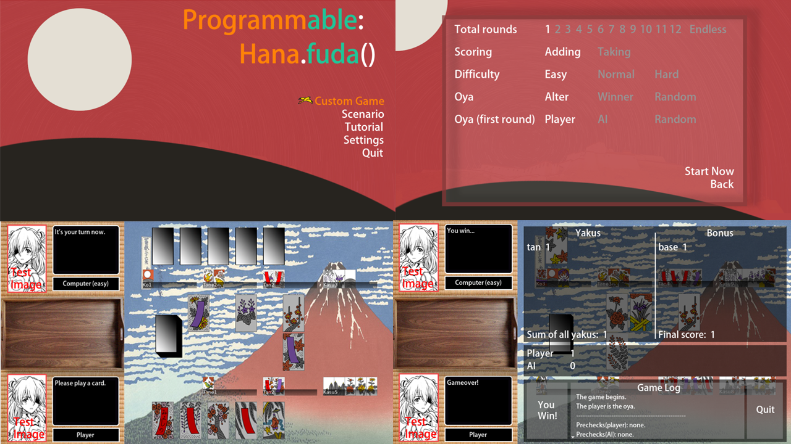

# Welcome to Programmable Hanafuda

Welcome to the world of hanafuda koi-koi, a two-player card game using traditional Japanese-style cards. There are many varients of koi-koi rules but no game was able to include them all -- until now. With the help of a Domain Specific Language (DSL), users can play with their self-defined rules, i.e. *yakus*, against computers.


*Snapshots of the game*

*Note: these snapshots do not represent the final version.*

## Features

### Custom Game
- Start a standard game immediately.
- Start a custom game with custom options: number of rounds, who plays first, which set of custom rules to use, etc.

### Scenario
**This part is still under development** 
- Challenge computers under weird, non-standard rules.
- Solve puzzles, find a way to win computers in difficult game settings.  

### Tutorial
**This part is still under development**
- View the tutorial, learn how to play hanafuda koi-koi if it is your first time.
- View the programmer's guide, learn how to write self-defined yakus and rules.

### Settings
**This part is still under development**
- Change player's name, avatar, volumes of BGM, SE, and voice, etc.

## Installation

### Windows

0. Install the [LOVE](https://love2d.org/) 2D game engine.

1. Clone the repository to your computer.

```shell
git clone https://github.com/H-Yulong/Programmable_Hanafuda.git
```

2. Create a *.zip* file with the repository. Make sure that the **main.lua is in the root directory of the archive**.

3. Rename the archive's ending from *.zip* to *.love*.

4. Double click (or any other way) to run.

### Other platforms

This game is made with [LOVE](https://love2d.org/) 2D game engine.
For installations on MacOS and Linux, please see [here](https://love2d.org/wiki/Game_Distribution).


## How to play

Left click to play, scroll to see hidden texts in textboxes.

For hanafuda koi-koi rules, check the [wiki](https://en.wikipedia.org/wiki/Koi-Koi) page or the *tutorial* in game.

## About hanafuda

[Hanafuda](https://en.wikipedia.org/wiki/Hanafuda) is a traditional Japanese card game. You may consider it as the Japanese version of pokers.

Hanafuda plays an important role in Japanese pop culture. The game company *Nintendo* started its business by producing hanafuda cards, and hanafuda appeared in lots of game/anime works, such as *Sakura Wars*, *Summar Wars*, and the *Yazuka series*.

## Future plans

These features are to be added in the short term:

- Background music and sound effects
- More difficult AIs (normal, hard)
- Implementing charater's facial expressions
- A tutorial
- Implementing the setting page

These features are to be added in the long term:

- An in-game IDE-like text editor for writing yaku definitions
- Creating better charater portraits
- Designing scenarios
- Showing yakus
- Adding more graphical resources
- Completing the toolbox in the battle page

*The university's term starts in October, and my update frequency would be much lower since then.*

## Grammars of the hanafuda language
Please see the programmer's guide (*Not ready yet*).
